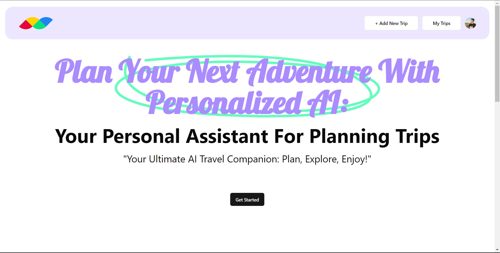
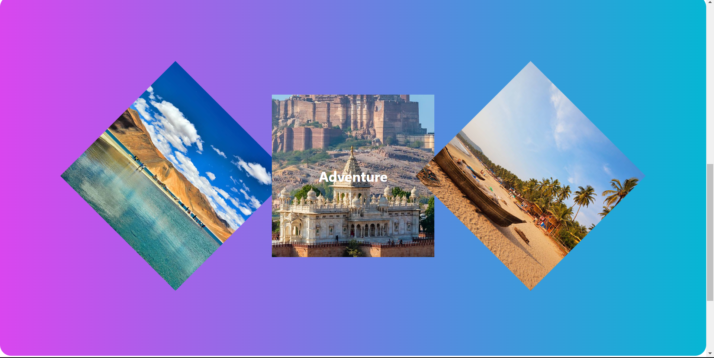
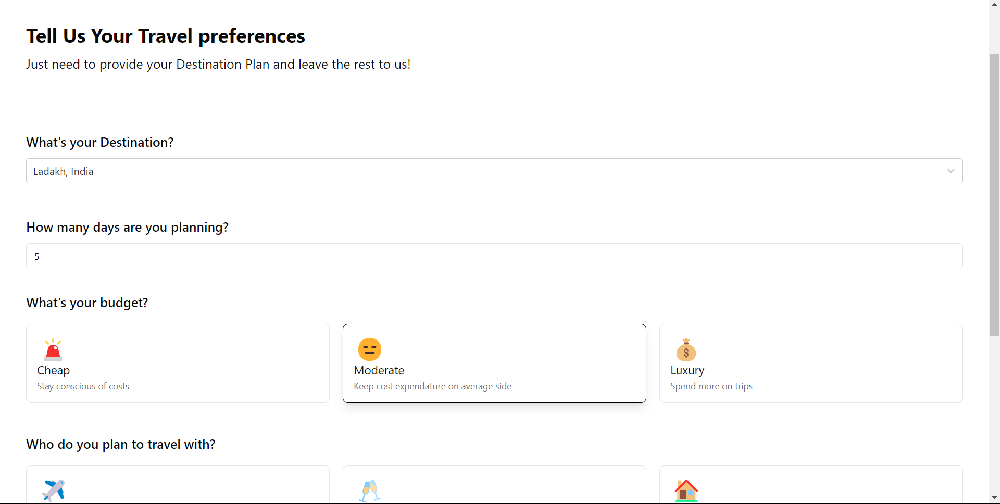
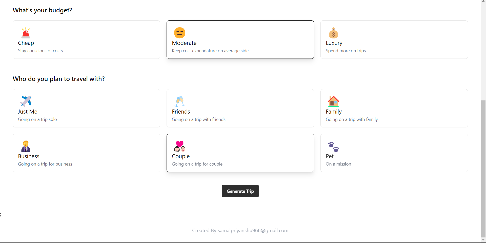
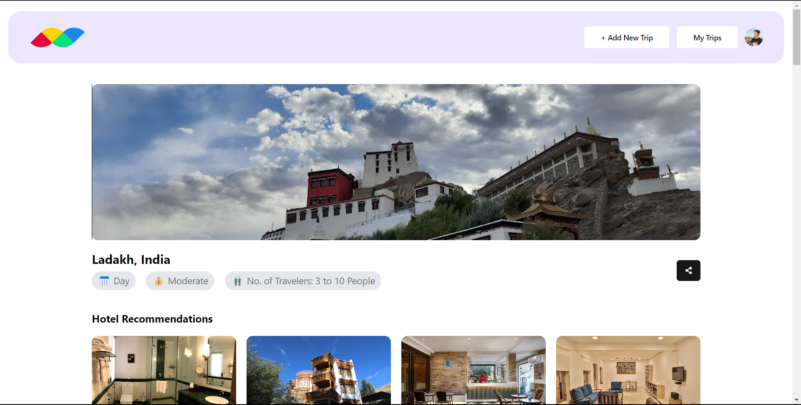
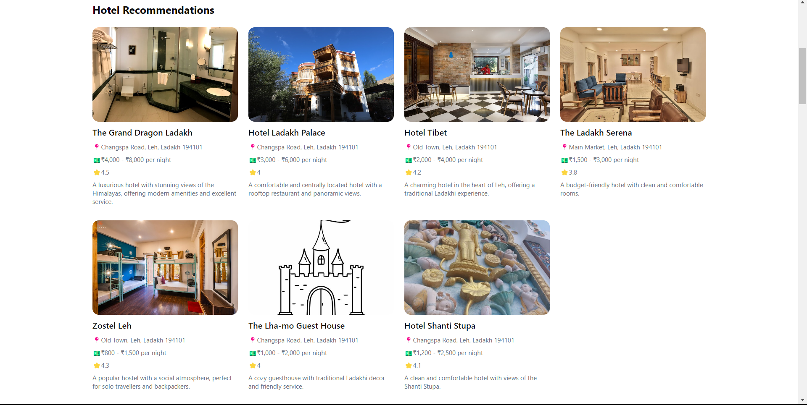
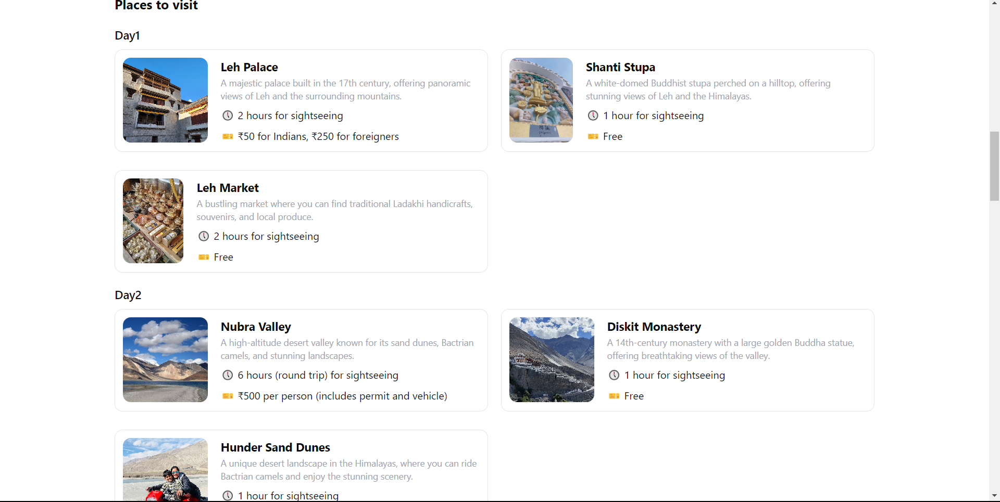
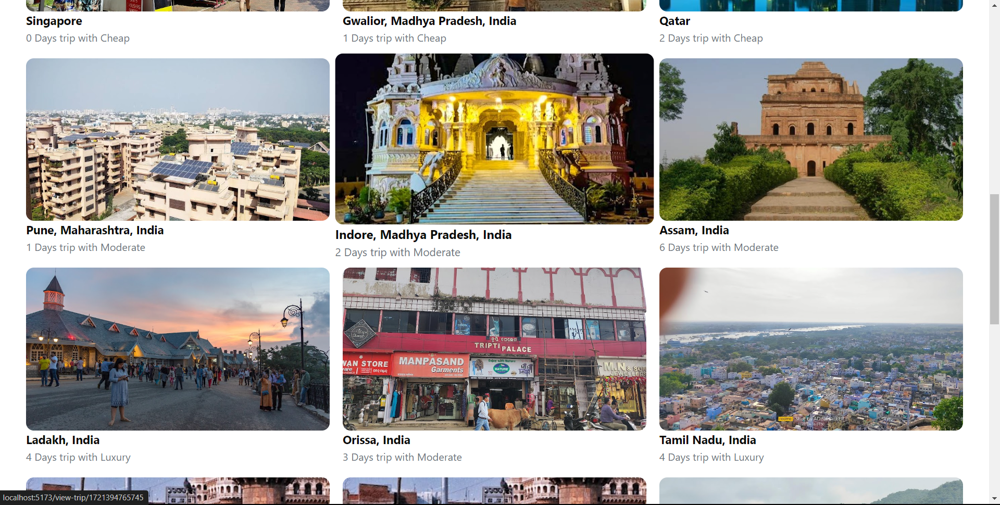

# Destiny - AI Travel Plan Maker and Management App

[Project Link](https://destiny-delta.vercel.app/)

Destiny is an AI-powered travel planning and management application that helps you create personalized travel plans. Using advanced technologies, Destiny generates trips based on your preferences, budget, and duration, providing hotel recommendations and day-wise places to visit.

## Features

- **Destination Selection**: Choose your travel destination using Google Maps API.
- **Personalized Trip Plans**: Enter the number of days, budget, and members for a custom trip plan.
- **Hotel Recommendations**: Get suggestions for the best hotels based on your preferences.
- **Daily Itineraries**: Receive a detailed day-wise plan of places to visit.
- **Trip History**: View and manage your past trips.

## Technologies Used

### Vite React
- **Description**: Vite is a modern frontend build tool that offers a fast development experience.
- **Usage**: Vite React is used for creating a responsive and dynamic user interface for Destiny.

### Tailwind CSS
- **Description**: Tailwind CSS is a utility-first CSS framework for building custom designs.
- **Usage**: Tailwind CSS is employed to style the application, ensuring a clean and user-friendly interface.

### Shadcn
- **Description**: Shadcn is used for creating reusable UI components.
- **Usage**: Shadcn components enhance the UI consistency and development efficiency.

### Gemini AI
- **Description**: Gemini AI provides advanced AI capabilities for generating travel plans.
- **Usage**: Gemini AI is integrated to analyze user inputs and generate personalized travel itineraries.

### Firebase
- **Description**: Firebase is a platform for building web and mobile applications.
- **Usage**: Firebase is utilized for backend services, including user authentication, database management, and storage.

### Google Photos API
- **Description**: Google Photos API allows access to photo storage and sharing features.
- **Usage**: Google Photos API is used to manage and display user trip photos within the app.

### Google Maps API
- **Description**: Google Maps API offers geolocation and mapping services.
- **Usage**: Google Maps API is used for destination selection and visualizing trip locations.

## Screenshots

### Home

*Welcome screen and introduction to Destiny.*

*Overview of features and user guide.*

### Create Trip

*Form for entering trip details like destination, number of days, budget, and members.*

*Options for customizing the trip plan and additional preferences.*

### Trip Results

*Generated trip plan with day-wise itineraries and hotel recommendations.*

*Detailed view of places to visit each day.*

*Map view of the trip route and locations.*

### View Trip (History)

*Overview of past trips with options to view details and manage history.*

Thank you for choosing Destiny! Enhance your travel planning experience with cutting-edge AI technology.
